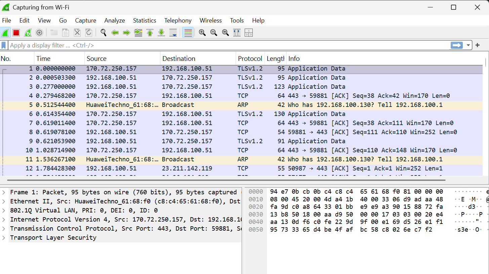
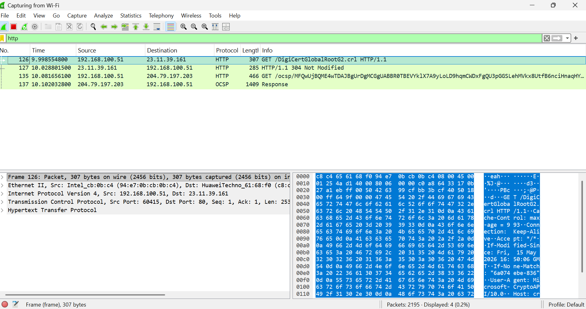
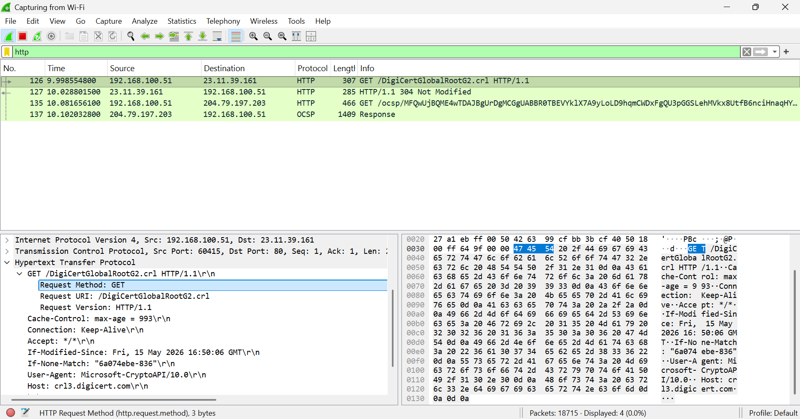
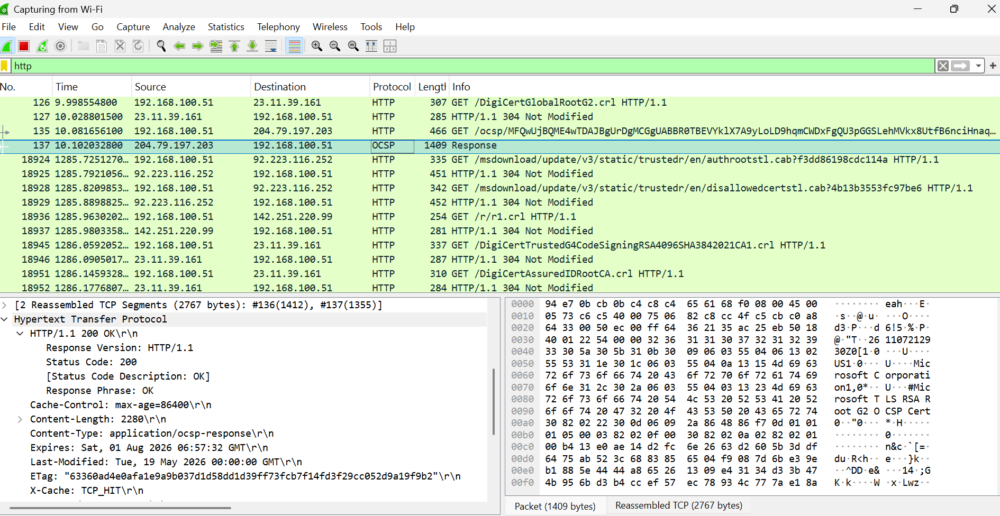
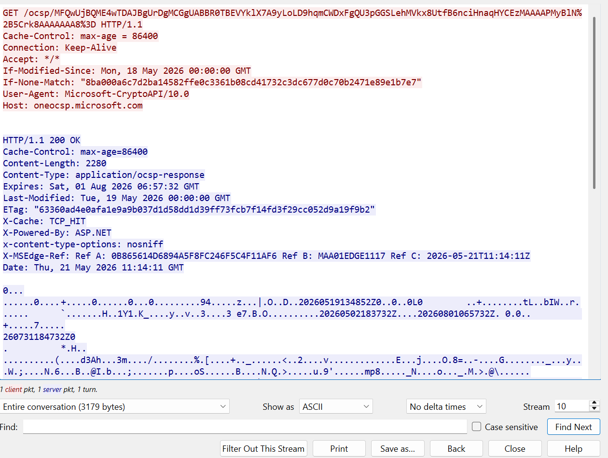
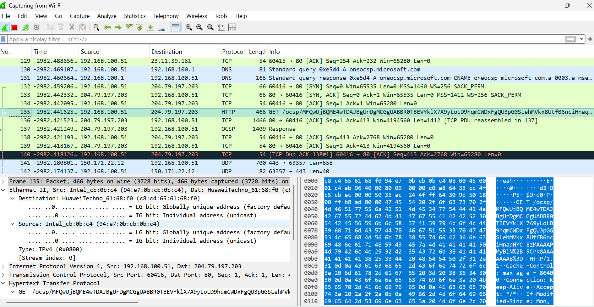

# HTTP Traffic Analysis Using Wireshark

## Overview

This project demonstrates how to capture and analyze HTTP network traffic using Wireshark. The analysis includes identifying HTTP requests and responses, examining packet details, and inspecting payload data transferred between a client and a web server.

The goal of this project is to build foundational packet analysis skills used in cybersecurity, SOC operations, and network troubleshooting.

---

## Tools and Protocols

### Hypertext Transfer Protcol (HTTP)
- Hypertext Transfer Protocol is the foundation of communication on the World Wide Web. It is an application-layer protocol used by web browsers and servers to exchange information such as webpages, images, and other web resources. HTTP works through a request-response model where a client sends a request to a server, and the server responds with the requested data along with status information.

- HTTP traffic analysis is important in cybersecurity and networking because it helps analysts understand how systems communicate over the internet. By inspecting HTTP packets, security professionals can identify suspicious activities, troubleshoot connectivity issues, detect malicious requests, and monitor web-based communications within a network environment.


### Wireshark 
- Wireshark is a widely used open-source network protocol analyzer designed for capturing and inspecting network traffic in real time. It allows users to examine packets at a very detailed level, making it one of the most important tools for network administrators, cybersecurity analysts, and SOC teams. Wireshark supports hundreds of protocols and provides powerful filtering and packet inspection capabilities.

- Using Wireshark, analysts can capture live traffic, investigate security incidents, troubleshoot network problems, and study how different protocols operate. Features such as packet filtering, TCP stream reconstruction, and protocol decoding make Wireshark an essential tool for learning network analysis and performing cybersecurity investigations.

## Objectives

- Capture live HTTP traffic
- Apply Wireshark display filters
- Analyze HTTP GET requests
- Inspect HTTP response packets
- Follow TCP streams
- Examine payload and protocol details

---

## Tools Used

| Tool | Purpose |
|------|---------|
| Wireshark | Packet capture and traffic analysis |
| Web Browser | Generate HTTP traffic |
| Windows Network Adapter | Capture network packets |

---

## Environment

- Operating System: Windows 11
- Wireshark Version: 4.x
- Protocol Analyzed: HTTP
- Test Website: `http://example.com`

---

# Step 1 — Capturing HTTP Traffic

Wireshark was launched and connected to the active internet interface. Traffic capture was started before visiting an HTTP website in the browser.

## Screenshot



---

# Step 2 — Filtering HTTP Packets

The `http` display filter was used to isolate HTTP traffic from other network packets.

## Filter Used

```text
http
```

## Screenshot



---

# Step 3 — Analyzing HTTP GET Requests

The captured GET request was inspected to analyze:

- Request Method
- Requested Resource
- Host Header
- User-Agent Information

## Key Observation

The browser initiated an HTTP GET request to retrieve the webpage content from the server.

## Screenshot



---

# Step 4 — Inspecting HTTP Responses

The server response packet was analyzed to identify:

- HTTP Status Code
- Content-Type
- Server Details
- Response Length

## Key Observation

The server responded with a successful `200 OK` status indicating the webpage was delivered correctly.

## Screenshot



---

# Step 5 — Following TCP Stream

Wireshark’s “Follow TCP Stream” feature was used to reconstruct the full HTTP conversation between the client and server.

## Screenshot



---

# Step 6 — Packet Structure Analysis

Detailed packet inspection was performed across multiple layers:

- Ethernet II
- Internet Protocol (IP)
- Transmission Control Protocol (TCP)
- Hypertext Transfer Protocol (HTTP)

## Screenshot



---

# Key Learning Outcomes

Through this project, I learned how to:

- Capture real network traffic
- Filter protocol-specific packets
- Analyze HTTP communication
- Understand request-response behavior
- Inspect packet-level details
- Use TCP stream reconstruction for analysis

---

# Skills Demonstrated

- Network Traffic Analysis
- Packet Inspection
- HTTP Protocol Analysis
- Wireshark Filtering
- TCP Stream Analysis
- Cybersecurity Fundamentals

---

# Repository Contents

```text
screenshots/     → Wireshark screenshots
README.md        → Project documentation
```

---

# Conclusion

This project provided practical experience in monitoring and analyzing HTTP traffic using Wireshark. Understanding packet-level communication is an essential skill for cybersecurity analysts, SOC analysts, and network engineers.

---